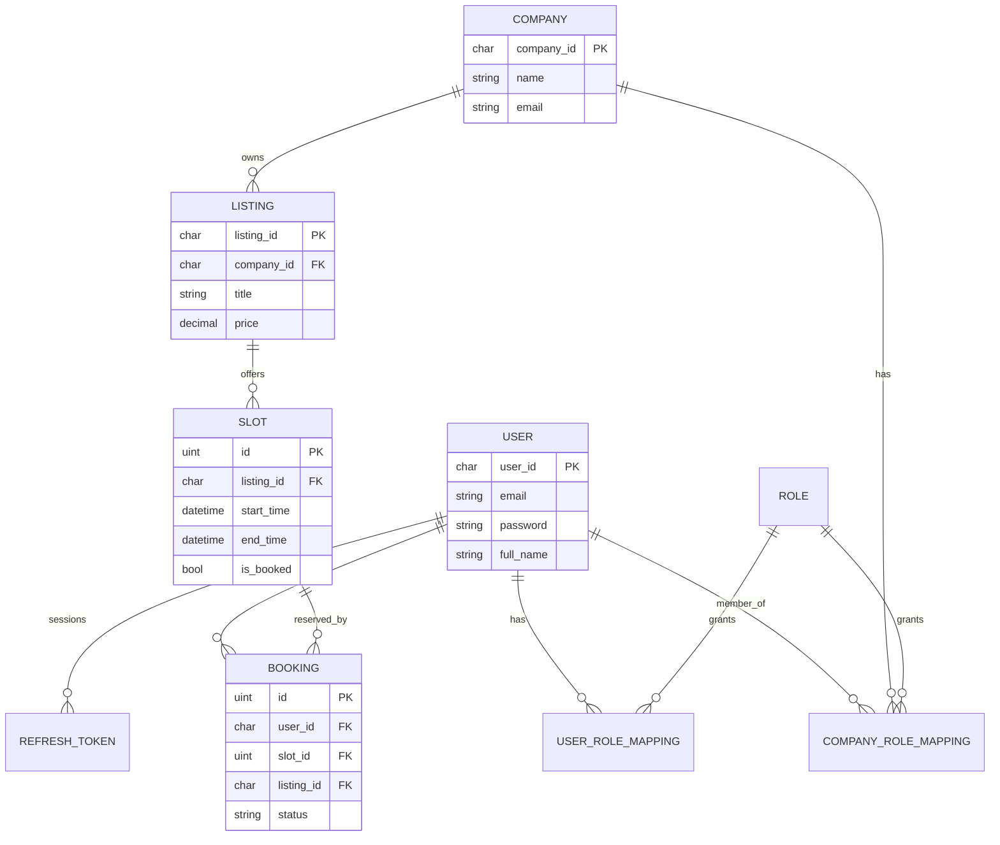
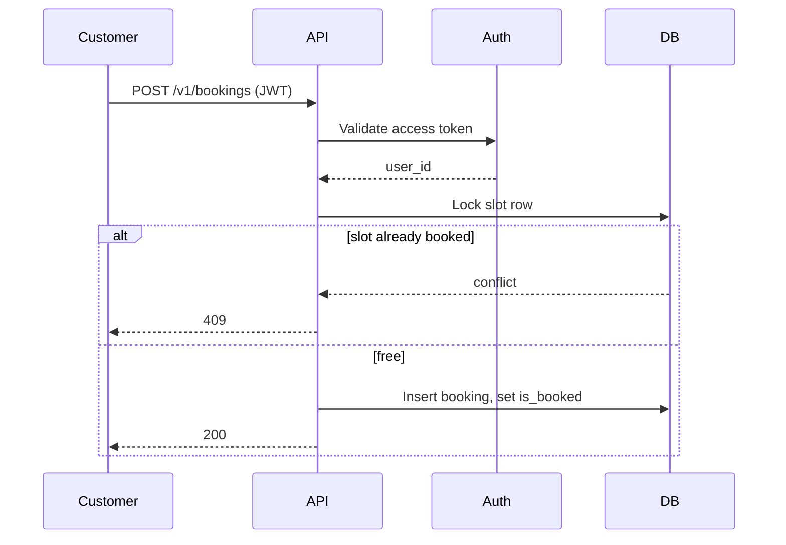

# Slotly

A **Go** REST API for service businesses (salons, clinics, coaches) to publish listings, open time slots, and take bookings.

One user account can browse any company’s catalog. **Writes** (listings, slots, company settings) require a membership on that company. Customers book slots without becoming staff.

---

## What works today

* Register / login with **bcrypt** passwords and **JWT** access tokens (15 minutes)
* **Refresh tokens** (7 days), stored hashed; logout and logout-all
* Identity comes from `Authorization: Bearer <access_token>` (not `user_id` in JSON)
* Seeded roles: `super_admin`, `org_admin`, `staff`, `customer` (no public role CRUD)
* Register assigns **customer**; create company assigns **org_admin** membership and keeps customer
* Listing and slot **writes** require org_admin or staff on that company
* Slot overlap checks on create/update
* Bookings: create, list mine, list by listing (staff), reschedule, cancel — with a row lock so two people cannot book the same slot
* Goose migrations on **MySQL**
* Public catalog: get company, listings, and slots without a token

---

## Architecture

```text
HTTP (Gin)
  → routes (public vs JWT middleware)
    → controllers
      → services
        → repositories (GORM)
          → MySQL
```

| Package | Role |
| ------- | ---- |
| `internal/bootstrap/apiserver` | HTTP server, route groups |
| `internal/auth` | Password hashing, JWT, `RequireAuth` |
| `internal/api/*` | Controllers and services |
| `internal/repository/*` | Data access |
| `internal/models` | GORM models |
| `migrations/` | Goose SQL |

---

## Roles

Roles live in `roles` (seeded, not an API). Assignments are separate tables.

| Role | Where it lives | Meaning |
| ---- | -------------- | ------- |
| `customer` (id 4) | `user_role_mappings` | Default on register; can book |
| `super_admin` (id 1) | `user_role_mappings` | Platform (not wired in handlers yet) |
| `org_admin` (id 2) | `company_role_mappings` | Owns/manages a company |
| `staff` (id 3) | `company_role_mappings` | Can write listings/slots for that company |

A user can be a **customer globally** and **org_admin of company A** at the same time. Staff of B cannot edit listings of A.

---

## Data model



---

## Auth

1. `POST /v1/users` or `POST /v1/auth/login` returns `access_token` and `refresh_token`.
2. Send `Authorization: Bearer <access_token>` on protected routes.
3. `POST /v1/auth/refresh` with `{ "refresh_token": "..." }` rotates the refresh token.
4. `POST /v1/auth/logout` revokes that refresh token. `POST /v1/auth/logout-all` (authenticated) revokes all sessions.

Set `JWT_SECRET` in production. If unset, a **dev-only** secret is used.

Passwords created before hashing was added will not log in; those users must register again.

---

## Booking flow



Creating **slots** (staff) also rejects overlapping times on the same listing.

---

## API

Base URL: `http://localhost:8080` (or `PORT`). Prefix `/v1`.

### Public

```text
GET    /health
GET    /live
POST   /v1/users
POST   /v1/auth/login
POST   /v1/auth/refresh
POST   /v1/auth/logout
GET    /v1/company/:id
GET    /v1/listing/:id
GET    /v1/listing/type/:type
GET    /v1/listing/company/:company_id
GET    /v1/listings/price/:price
GET    /v1/slot/:id
GET    /v1/listing/:id/slots
```

### Authenticated

```text
POST   /v1/auth/logout-all
GET    /v1/me
GET    /v1/user/:id          # own profile only
PUT    /v1/user/:id
DELETE /v1/user/:id
GET    /v1/user-role         # own global role mapping

POST   /v1/companies
PUT    /v1/company/:id       # membership required
DELETE /v1/company/:id

POST   /v1/listings
PUT    /v1/listing/:id
DELETE /v1/listing/:id

POST   /v1/slots
PUT    /v1/slot/:id
DELETE /v1/slot/:id

POST   /v1/bookings
GET    /v1/bookings
GET    /v1/bookings/listing/:listing_id
GET    /v1/booking/:id
PUT    /v1/booking/:id       # reschedule or status=cancelled
DELETE /v1/booking/:id
```

### Example: register

```http
POST /v1/users
Content-Type: application/json
```

```json
{
  "first_name": "Ada",
  "last_name": "Lovelace",
  "email": "ada@example.com",
  "phone_number": "5550001111",
  "password": "a-long-password"
}
```

### Example: book a slot

```http
POST /v1/bookings
Authorization: Bearer <access_token>
Content-Type: application/json
```

```json
{
  "listing_id": "listing-uuid",
  "slot_id": 12
}
```

Identity is **not** sent in the body.

---

## Tech stack

| Layer | Technology |
| ----- | ---------- |
| Language | Go |
| HTTP | Gin |
| Database | MySQL |
| ORM | GORM |
| Migrations | Goose |
| Auth | bcrypt + JWT (`github.com/golang-jwt/jwt/v5`) |

---

## Getting started

### Prerequisites

* Go 1.22+ (module is `go 1.26.6`)
* MySQL 8 with a database named `slotly` (or whatever your DSN uses)
* [Goose](https://github.com/pressly/goose)

### Configure

```bash
export DATABASE_DSN='user:pass@tcp(127.0.0.1:3306)/slotly?charset=utf8mb4&parseTime=True&loc=Local'
export JWT_SECRET='a-long-random-secret'
export PORT=8080
export GOOSE_DRIVER=mysql
export GOOSE_DBSTRING='user:pass@tcp(127.0.0.1:3306)/slotly'
export GOOSE_MIGRATION_DIR=migrations
```

If `DATABASE_DSN` is unset, the server uses `root@tcp(127.0.0.1:3306)/slotly?charset=utf8mb4&parseTime=True&loc=Local`.

### Migrate and run

```bash
goose up
go run .
```

Health: `GET http://localhost:8080/health`

---

## Roadmap

### Done

- [x] Layered Go API (controller / service / repository)
- [x] MySQL + Goose
- [x] JWT access + hashed refresh tokens
- [x] Password hashing
- [x] Company, listing, slot, booking
- [x] Membership-based listing/slot writes
- [x] Double-book lock on slot booking
- [x] Private seeded roles

### Next

- [ ] Staff invite (membership without creating a company)
- [ ] Transactions on user/company create (user + role in one commit)
- [ ] Lookup roles by name instead of hardcoded ids
- [ ] Super-admin APIs
- [ ] Tests (auth, overlap, double-book)
- [ ] Rate limiting, CORS, structured error codes
- [ ] OpenAPI / Swagger
- [ ] Docker, CI, graceful shutdown, DB pool settings
- [ ] Pagination on list endpoints

### Later

- [ ] Redis, email, audit logs
- [ ] Payments, calendar sync, webhooks

---

## License

MIT
